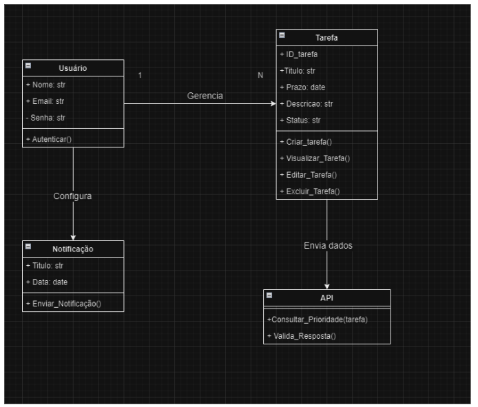

# Diagrama de Classes
O `Diagrama de Classes` detalha a estrutura das classes principais do sistema, incluindo:

## Classes e suas Funções

### **Usuário**
Representa os usuários que utilizam o sistema.

- **Atributos**:
  - `Nome: str`: Nome do usuário.
  - `Email: str`: Endereço de email do usuário.
  - `Senha: str`: Senha utilizada para autenticação.
- **Métodos**:
  - `Autenticar()`: Verifica as credenciais fornecidas pelo usuário para autenticação.

### **Tarefa**
Responsável pela gestão de tarefas atribuídas aos usuários.

- **Atributos**:
  - `ID_tarefa: str`: Identificador único da tarefa.
  - `Título: str`: Título descritivo da tarefa.
  - `Prazo: date`: Data limite para conclusão da tarefa.
  - `Descrição: str`: Detalhes sobre a tarefa.
  - `Status: str`: Estado atual da tarefa (ex.: pendente, concluída).
- **Métodos**:
  - `Criar_tarefa()`: Permite a criação de uma nova tarefa.
  - `Visualizar_Tarefa()`: Exibe os detalhes de uma tarefa.
  - `Editar_Tarefa()`: Permite a atualização das informações de uma tarefa.
  - `Excluir_Tarefa()`: Remove uma tarefa do sistema.

### **Notificação**
Gerencia notificações enviadas aos usuários.

- **Atributos**:
  - `Título: str`: Título da notificação.
  - `Data: date`: Data em que a notificação foi enviada.
- **Métodos**:
  - `Enviar_Notificação()`: Envia uma notificação ao usuário.

### **API**
Representa a interface de comunicação com sistemas externos para integração de funcionalidades.

- **Métodos**:
  - `Consultar_Prioridade(tarefa)`: Consulta a prioridade de uma tarefa em sistemas externos.
  - `Valida_Resposta()`: Valida a resposta recebida da API.

## Relações entre as Classes

1. **Usuário**:
   - Um usuário pode gerenciar múltiplas tarefas (relação *1:N* com a classe `Tarefa`).
   - O usuário também configura notificações relacionadas às suas atividades.

2. **Tarefa**:
   - As tarefas podem interagir com a API para consultar informações externas ou validar respostas.

3. **Notificação**:
   - Está associada ao usuário e é configurada para envio automático.