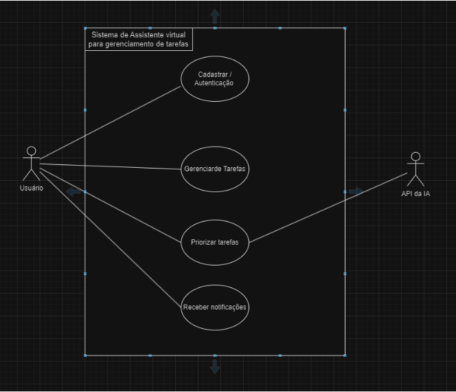
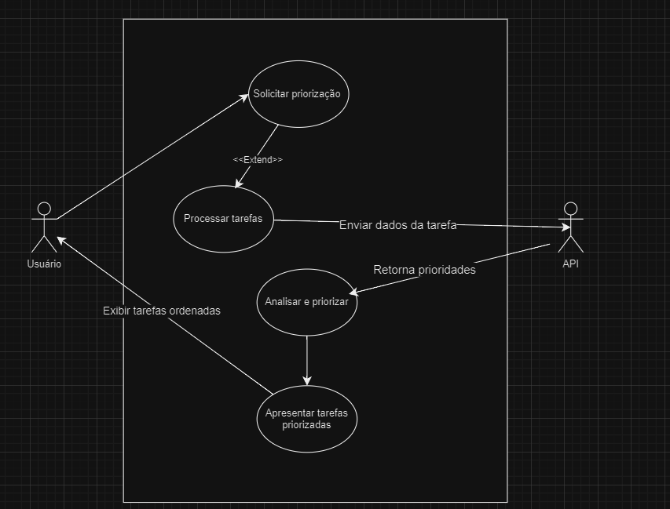

# Diagrama de caso de uso
O `sistema de gerenciamento de tarefas possui o seguinte` possui um diagrama de Caso de Uso, que ilustra os atores e os casos de uso principais do sistema, com foco nas interações do usuário com o sistema de login, gerenciamento de tarefas, priorização de tarefas, e notificações.

## Versão Macro

## Cenário de Caso de Uso (CCU1)
Referente à cadastrar/autenticar usuários

| **Nome do caso de uso**        | Cadastrar/Autenticação de usuário                          |
| ------------------------------ | --------------------------------------------------------- |
| **Descrição**                  | Usuário vai fazer login ou se cadastrar no site            |
| **Atores**                     | Usuário                                                   |
| **Pré-Condições**              | Estar no navegador                                         |
| **Fluxo principal**            | 1. Usuário abre o site                                     |
|                                | 2. Preenche os dados de nome e senha                       |
|                                | 3. O sistema confirma os dados                             |
|                                | 4. O usuário tem acesso ao sistema                         |
| **Fluxo alternativo**          | 1. O usuário digita nome ou senha inválido                 |
|                                | 2. O sistema exibe uma mensagem de erro e avisa para o usuário |
| **Regra de execução**          | Se já existir um nome de usuário, uma mensagem de erro deve ser exibida solicitando que o usuário escolha outro nome. |

## Cenário de Caso de Uso (CCU2)
Referente ao requisito funcional 1 (RF1: Tarefas)

| **Nome do caso de uso**        | Gerenciar tarefas                                           |
| ------------------------------ | ----------------------------------------------------------- |
| **Descrição**                  | Criar, ler, editar e excluir tarefas                        |
| **Atores**                     | Usuário                                                     |
| **Pré-Condições**              | Usuário deve estar logado                                   |
| **Fluxo principal**            | 1. Usuário escolhe o que quer fazer com a tarefa            |
|                                | 2. O dado vai ser atualizado no banco de dados              |
| **Fluxo alternativo**          | 1. O sistema não consegue atualizar o banco de dados        |
|                                | 2. O sistema informa que não foi possível confirmar a ação  |
| **Regra de execução**          | O sistema deve validar os dados (campos) da tarefa antes de atualizar o banco de dados |

## Cenário de Caso de Uso (CCU3)
Referente ao requisito funcional 3 (RF3: Priorização de Tarefas)

| **Nome do caso de uso**        | Priorizar tarefas                                           |
| ------------------------------ | ----------------------------------------------------------- |
| **Descrição**                  | O sistema sugere uma ordem para a execução das tarefas      |
| **Atores**                     | Usuário e API da IA                                         |
| **Pré-Condições**              | As tarefas devem estar cadastradas                          |
| **Fluxo principal**            | 1. Usuário solicita uma sugestão                            |
|                                | 2. API analisa as informações de cada tarefa e sugere as prioridades das tarefas |
| **Fluxo alternativo**          | 1. Não há nenhuma sugestão                                  |
|                                | 2. O sistema mostra uma frase padrão avisando que a prioridade já está adequada |
| **Regra de execução**          | Se a API de IA estiver fora do ar ou inacessível, o sistema exibe uma mensagem informando que a priorização não está disponível |

## Cenário de Caso de Uso (CCU4)
Referente ao requisito funcional 4 (RF4: Notificações de Tarefas)

| **Nome do caso de uso**        | Receber notificações                                        |
| ------------------------------ | ----------------------------------------------------------- |
| **Descrição**                  | Sistema envia lembrete das tarefas                          |
| **Atores**                     | Usuário                                                     |
| **Pré-Condições**              | Tarefa deve ter algum lembrete configurado                  |
| **Fluxo principal**            | 1. Sistema verifica as tarefas                              |
|                                | 2. Envia a notificação de acordo com a data da tarefa       |
| **Fluxo alternativo**          | O usuário ignora a notificação e arquiva a notificação      |
| **Regra de execução**          | O sistema deve verificar se as notificações estão ativadas para cada tarefa antes de enviar o lembrete |

## Versão Específica de Priorização de Tarefas

Este documento descreve o diagrama de caso de uso para a priorização de tarefas, destacando as interações entre o **Usuário**, o sistema e uma **API** externa.

## Atores

- **Usuário**: Principal responsável por interagir com o sistema, iniciando o processo de priorização e recebendo como resultado as tarefas ordenadas.
- **API**: Serviço externo que processa os dados enviados pelo sistema e retorna as prioridades das tarefas.

## Casos de Uso

1. **Solicitar priorização**  
   - O ponto de partida do fluxo, onde o Usuário inicia o processo de priorização.  
   - Este caso de uso é **estendido** pelo caso "Processar tarefas".

2. **Processar tarefas**  
   - Responsável por analisar as informações das tarefas enviadas pelo Usuário.  
   - Envia os dados das tarefas para a **API** externa para processamento.  
   - Recebe as prioridades definidas pela API e inicia o processo de organização.

3. **Analisar e priorizar**  
   - Realiza o tratamento dos dados retornados pela API e organiza as tarefas de acordo com suas prioridades.

4. **Apresentar tarefas priorizadas**  
   - Finaliza o fluxo interno, apresentando as tarefas organizadas para o Usuário.

5. **Exibir tarefas ordenadas**  
   - Exibe as tarefas priorizadas para o Usuário, encerrando o processo.

## Fluxo de Interação

1. O **Usuário** inicia o processo solicitando a priorização.
2. O sistema processa os dados das tarefas e comunica-se com a **API** para receber as prioridades.
3. Após a análise e organização, o sistema apresenta as tarefas priorizadas ao Usuário.
4. O **Usuário** visualiza as tarefas ordenadas.

