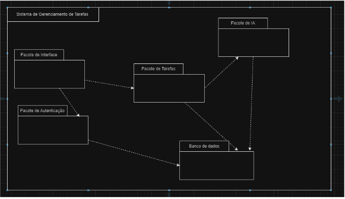

# Diagrama de Pacotes
Este `diagrama de pacotes` organiza os componentes principais do sistema de gerenciamento de tarefas, destacando as dependências entre eles.

## Pacotes

1. **Pacote de Interface**  
   - Representa a camada de interação com o usuário.
   - Depende do **Pacote de Autenticação** para validar o acesso e do **Pacote de Tarefas** para exibir e manipular as tarefas.

2. **Pacote de Autenticação**  
   - Responsável pela validação dos usuários.
   - Comunica-se com o **Banco de Dados** para armazenar e verificar credenciais.

3. **Pacote de Tarefas**  
   - Gerencia a lógica relacionada às tarefas, como criação, edição e priorização.
   - Depende do **Pacote de IA** para priorizar tarefas e do **Banco de Dados** para persistir informações.

4. **Pacote de IA**  
   - Contém os serviços de inteligência artificial utilizados para priorização de tarefas.
   - Conecta-se ao **Pacote de Tarefas** para receber dados e fornecer resultados.

5. **Banco de Dados**  
   - Centraliza o armazenamento de informações, incluindo dados de usuários, tarefas e registros necessários para o funcionamento do sistema.
   - Suporta o **Pacote de Autenticação** e o **Pacote de Tarefas**.

## Dependências

- O **Pacote de Interface** depende dos pacotes de lógica e autenticação para fornecer funcionalidades ao usuário.
- O **Pacote de Tarefas** é o núcleo do sistema, conectando-se ao **Pacote de IA** para cálculos de prioridade e ao **Banco de Dados** para persistência de dados.
- O **Banco de Dados** atua como suporte fundamental para diversos pacotes, garantindo a integridade dos dados.