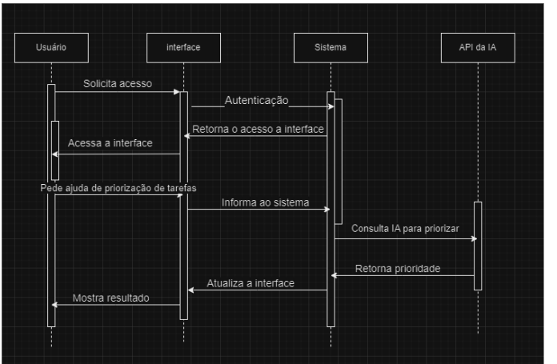

# Diagrama de Sequência
O `Diagrama de Sequência` mostra o fluxo de interações entre os objetos do sistema. Ele ilustra como o usuário interage com a interface web, como as tarefas são processadas no backend e como a API de IA sugere a priorização das tarefas.

## Descrição do Fluxo

1. **Solicitar acesso**:  
   O **Usuário** solicita acesso à interface.

2. **Autenticação**:  
   A **Interface** comunica-se com o **Sistema** para autenticar o Usuário.

3. **Retorno de acesso**:  
   Após a autenticação, o acesso à interface é liberado para o Usuário.

4. **Pedido de ajuda na priorização de tarefas**:  
   O **Usuário** solicita à interface que auxilie na priorização de tarefas.

5. **Consulta ao sistema**:  
   A **Interface** informa ao **Sistema** a solicitação do Usuário.

6. **Consulta à API de IA**:  
   O **Sistema** se comunica com a **API de IA**, enviando os dados para priorização.

7. **Retorno de prioridade**:  
   A **API de IA** processa os dados e retorna as prioridades ao **Sistema**.

8. **Atualização da interface**:  
   O **Sistema** atualiza a **Interface** com os resultados priorizados.

9. **Exibição do resultado**:  
   A **Interface** apresenta as tarefas priorizadas ao **Usuário**.
